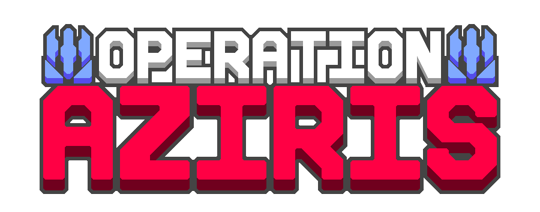

# Operation: Aziris
***Aziris**. A planet of breathtaking beauty and immense value, coveted by many for a single reason: **Erythronite Crystals**. These rare and powerful crystals, found only on Aziris, are both a potent energy source and a versatile material.*

*For centuries, Aziris has been in the hands of the **Sentinels**, an ancient and highly advanced faction native to the planet. Their mastery of energy manipulation and crystal resonance makes them formidable defenders, ensuring that their precious Erythronite remains out of the hands of outsiders.*

*But now, the Sharded has set its optical scanners on the planet. It is up to you to conquer Aziris and seize its resources for your own.*

*Yet you will not be alone in your pursuit. Other factions are present on the planet as well. They too seek the riches of Aziris. Then there are the Sentinels, a threat in their own right, and they will stop at nothing to put an end to the outsiders.*

*Only the strongest will prevail. The fate of Aziris hangs in the balance.*

---

This is a WIP mod that will add Aziris, a new planet with plenty of new content to explore. There is no campaign yet but all mod content can be checked out in the sandbox. You can also join our discord server for custom maps, providing feedback, and more!

## Authors:
Programming: Slashkig

Sprite Artists: IAmRustee and VoidThreader

Translators: Phil
More translators are welcome!